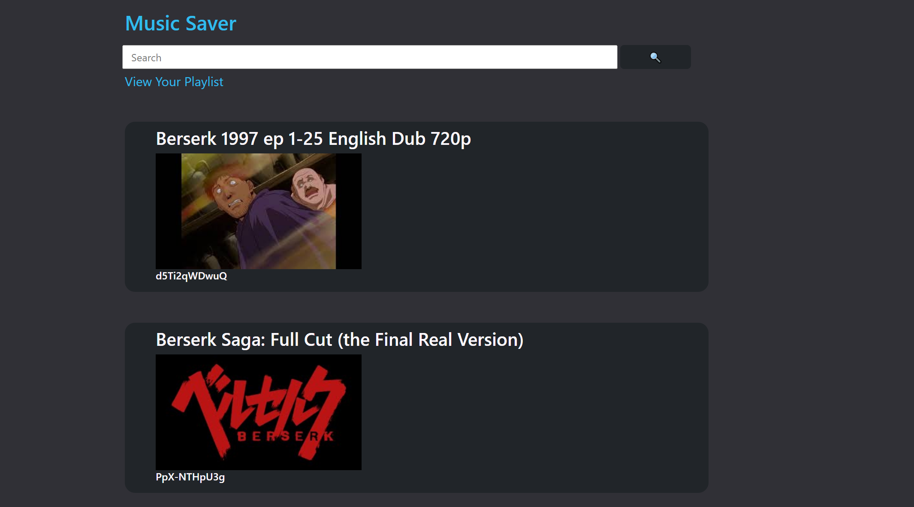
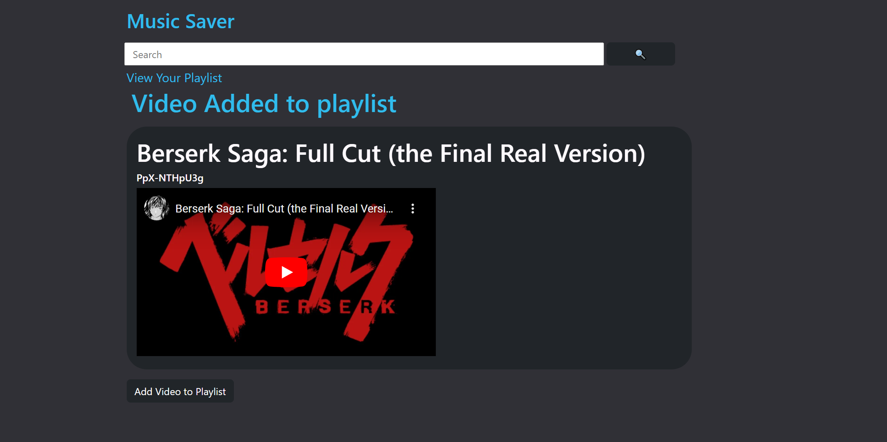
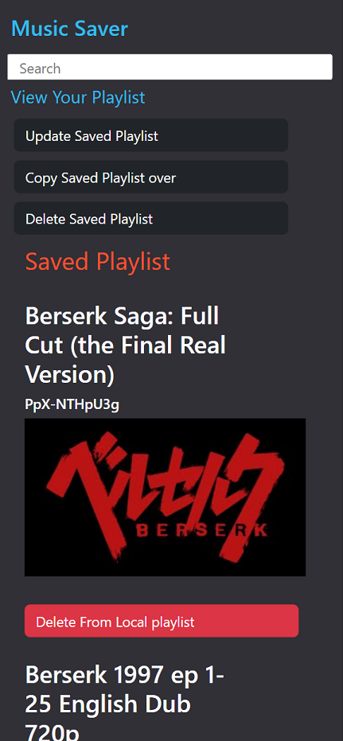

### Music Saver

The goal of this project is to allow users to search for youtube videos and save them into a "playlist" of sorts that honestly just saves the name of the videos. I listen to alot of videogame music and hate it whenever it gets taken down. so having a list of all my songs to look back at would be super useful.

### Tools Used

-   Node
-   Express
-   EJS
-   Axios
-   Heroku

### Pseudo-Code/Functionality

When the user lands on the main page I want:
>   a search bar that allows you to look for youtube videos 

This uses the Youtube v3 API to get the video info that we need (snippet); 
With that we use a get request with the appropriate search parameter to find the video we are looking for: 
> Display the list of results related to parameter used for search
- allow for each video result to be clickable and once clicked:
> display the video info onto page
- allow for a button to save to personal playlist
    - that personal playlist stores all the info I want into an object inside an array...
    - once data is populated on that array, the array should be placed into local storage
> if you have one, you should be able to see a button to your playlist anywhere on the site
-   this will use that array that we have in local storage
-   clicking on that playlist button will also redirect to a new page
    - that page, (like the search page) will list all of YOUR videos instead, allowing you to see the video info
    - we should be able to delete any video from that playlist using a button
> So in essence I want 4 pages,
1.  a home page with a search 
2.  the search result page
3.  video info page
4.  playlist page
---

### Images

 

 

 
